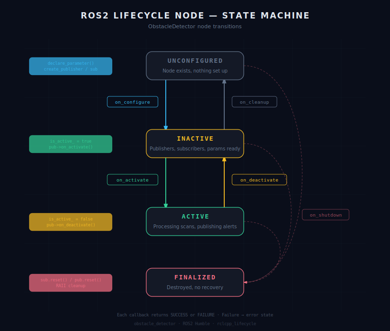

# Obstacle Detector

A ROS2 lifecycle component node that subscribes to /scan (LaserScan), detects obstacles within a configurable threshold, and publishes alerts to /obstacle_alert (Bool).

## Lifecycle State Diagram

<div align="center">



*State machine diagram · Created with Claude AI · Based on rclcpp_lifecycle*

</div>
## Concepts Demonstrated

- **Lifecycle node** — Controlled startup/shutdown through explicit state transitions — node only processes data when activated.
- **Component node** — No main(), registered via macro, loadable into a shared container with other nodes.
- **LifecyclePublisher** — Has its own active/inactive state, silently drops messages when deactivated. No LifecycleSubscription exists ,only publishing needs lifecycle control.
- **shared_ptr** — ROS2 uses shared_ptr for publishers, subscribers, and messages because multiple parts of the system need access to the same object.
- **QoS configuration** — RELIABLE for alerts (guaranteed delivery), BEST_EFFORT for scan data (fire and forget).
- **Lambda capture [this]** — Captures the class instance so the subscriber callback can access member variables like the threshold and publisher.
- **ROS2 parameters** — Danger threshold declared as a parameter so it can be changed at launch without recompiling.
- **RAII (shared_ptr reset)** — reset() in on_cleanup releases the shared_ptr, letting the smart pointer handle destruction automatically.

## Prerequisites

- ROS2 Humble
- Ubuntu 22.04
- TurtleBot3 packages (for testing)
- colcon build tools

## How to Build
```bash
cd ~/robotics-cpp-portfolio
source /opt/ros/humble/setup.bash
colcon build --symlink-install --packages-select obstacle_detector
source install/setup.bash
```

## How to Launch
```bash
ros2 launch obstacle_detector obstacle_detector_launch.py
```

The launch file auto-configures and auto-activates the node.

## How to Test

### With TurtleBot3 Gazebo

Terminal 1 — launch simulation:
```bash
export TURTLEBOT3_MODEL=waffle
ros2 launch turtlebot3_gazebo turtlebot3_world.launch.py
```

Terminal 2 — launch obstacle detector:
```bash
cd ~/robotics-cpp-portfolio
source install/setup.bash
ros2 launch obstacle_detector obstacle_detector_launch.py
```

Terminal 3 — monitor alerts:
```bash
ros2 topic echo /obstacle_alert
```

Terminal 4 — drive the robot:
```bash
ros2 run turtlebot3_teleop teleop_keyboard
```

### Manual Lifecycle Commands
```bash
ros2 run obstacle_detector obstacle_detector_exec
# In another terminal:
ros2 lifecycle set /obstacle_detector configure
ros2 lifecycle set /obstacle_detector activate
ros2 lifecycle set /obstacle_detector deactivate
ros2 lifecycle set /obstacle_detector cleanup
ros2 lifecycle set /obstacle_detector shutdown
```

### Override Parameters
```bash
ros2 run obstacle_detector obstacle_detector_exec --ros-args -p obstacle_distance_threshold:=0.3
```

## What I Learned

Learned how lifecycle nodes manage startup and shutdown through explicit state transitions (configure, activate, deactivate, cleanup, shutdown), how component nodes are registered without a main() function and loaded into containers, and how LifecyclePublisher controls message flow based on the node's active state.