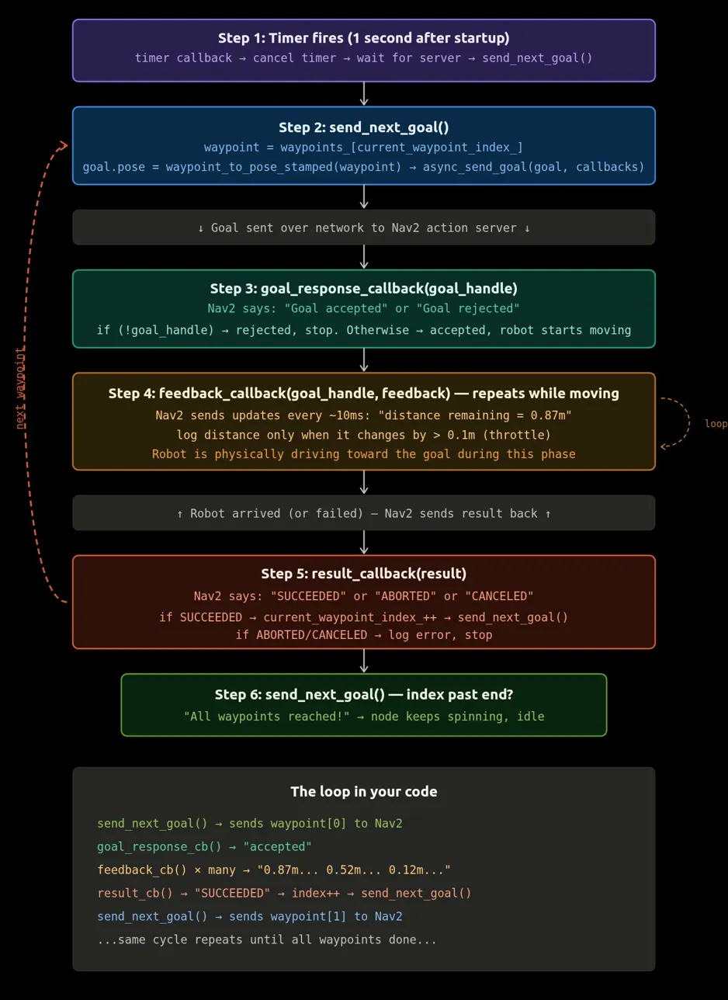

# Waypoint Follower

A C++ action client that navigates TurtleBot3 through predefined waypoints using Nav2's NavigateToPose action server.

## Execution Flow

<div align="center">



*Action client execution flow · Nav2 NavigateToPose*

</div>

## Concepts Demonstrated

- **Action client pattern** — Sends goals to Nav2 and gets three callbacks back: goal response (accepted/rejected), feedback (distance remaining while moving), and result (succeeded/failed). Event-driven — node goes idle after sending, Nav2 pushes updates.
- **Templates** — Anything in angle brackets `<>` is a template. `Client<NavigateToPose>`, `ClientGoalHandle<NavigateToPose>`, `vector<Waypoint>` — same class configured for different types.
- **std::vector** — Holds the list of waypoints. Variable length, iterated by index using `size_t`.
- **Type aliases (using)** — Substitutes long template types like `rclcpp_action::ClientGoalHandle<nav2_msgs::action::NavigateToPose>` with just `GoalHandle`. Stops the types from obscuring the actual logic.
- **std::bind** — Connects callback methods to SendGoalOptions so ROS2 knows which function to call when Nav2 sends a goal response, feedback, or result.
- **Header/source split** — Declarations in `.hpp`, implementations in `.cpp`. Separates what the class has from how it works.
- **Quaternions** — Nav2 needs orientation as a quaternion (x, y, z, w) instead of roll/pitch/yaw. Avoids gimbal lock and makes rotation math reliable. Converted via `tf2::Quaternion::setRPY()`.
- **Member initializer list** — Action client constructed directly in the initializer list instead of assigning in the constructor body. Constructs once instead of default-constructing then overwriting.

## Prerequisites

- ROS2 Humble
- Ubuntu 22.04
- Nav2 and TurtleBot3 packages
- tf2, tf2_geometry_msgs
- colcon build tools

## How to Build
```bash
cd ~/robotics-cpp-portfolio
source /opt/ros/humble/setup.bash
colcon build --packages-select waypoint_follower
source install/setup.bash
```

## How to Run

Terminal 1 — launch TurtleBot3 in Gazebo:
```bash
export TURTLEBOT3_MODEL=waffle
ros2 launch turtlebot3_gazebo turtlebot3_world.launch.py
```

Terminal 2 — launch Nav2:
```bash
export TURTLEBOT3_MODEL=waffle
ros2 launch turtlebot3_navigation2 navigation2.launch.py use_sim_time:=true
```

Terminal 3 — set initial pose in RViz, then run:
```bash
source ~/robotics-cpp-portfolio/install/setup.bash
ros2 run waypoint_follower waypoint_follower_node
```

## What I Learned

Learned how the ROS2 action client pattern works end to end from sending goals, handling three separate callbacks, and waypoints by calling send_next_goal() from the result callback. Understood that the node is event-driven, not sequential that it sends a goal and goes idle while Nav2 handles path planning, obstacle avoidance, and motor commands. Also learned how quaternions replace roll/pitch/yaw for orientation and why type aliases make template-heavy ROS2 code actually readable.